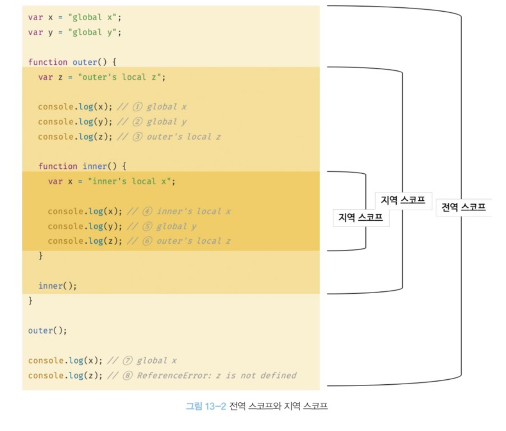

# 스코프

### 개요

함수의 매개변수는 함수 몸체 내부에서만 참조할 수 있고 함수 몸체 외부에서는 참조 할 수 없다. 이것은 매개변수를 참조할 수 있는 유효범위, 즉 매개변수의 스코프가 함수 몸체 내부로 한정되기 때문이다.

```js
function add(x, y) {
  // 매개변수는 함수 몸체 내부에서만 참조할 수 있다.
  // 즉 매개변수의 스코프는 함수 몸체 내부다.

  console.log(x, y); // 2 5
  return x + y;
}

add(2, 5); // 7

// 매개변수는 함수 몸체 내부에서만 참조 가능
console.log(x, y); // x is not defind
```

모든 식별자는 자신이 선언된 위치에 의해 다른 코드가 식별자 자신을 참조할 수 있는 유효 범위가 결정된다. 이를 스코프라 한다. 스코프는 식별자가 유효한 범위를 말한다.

### 스코프의 종류

전역과 지역으로 구분할 수 있다.



- 전역이란 코드의 바깥 영역을 말한다.
- 전역 변수는 어디서든지 참조할 수 있다.

### 지역과 지역 스코프

지역이란 함수 몸체 내부를 말한다. 지역 변수는 자신의 지역 스코프와 하위 지역 스코프에서 유효하다.

함수는 중첩될 수 있으므로 함수의 지역 스코프도 중첩될 수 있다. 스코프가 함수의 중첩에 의해 계층적으로 구조를 갖는다는 것을 의마한다. 중첩 함수의 지역 스코프는 중첩 함수를 포함하는 외부 함수의 지역 스코프와 계층적 구조를 갖는다.

아래 그림과 같이 outer 함수가 만든 지역 스코프는 inner 함수가 만든 지역 스코프의 상위 스코프다. 그리고 outer 함수의 지역 상위 스코프는 전역 스코프다.

이렇게 스코프가 계층적으로 연결된 것을 스코프 체인이라 한다.

변수를 참조할 떄 스코프 체인을 통해 변수를 참조하는 코드의 스코프에서 시작하여 상위 스코프 방향으로 이동하며 선언된 변수를 검색한다. 이를 통해 상위 스코프에서 선언한 변수를 하위 스코프에서도 참조할 수 있다.


## 함수 레벨 스코프 (Function-Level Scope)

### 개요

함수 레벨 스코프(Function-Level Scope)는 변수가 함수 내부에서 정의되었을 때, 함수 내에서만 유효한 스코프를 가지는 것을 의미합니다. JavaScript에서 `var` 키워드로 선언된 변수는 함수 레벨 스코프를 따릅니다.

### 특징

1. **함수 내 어디서든 접근 가능**:

   - `var`로 선언된 변수는 함수 내 어디서든 접근할 수 있습니다.
   - 이는 블록(`{}`) 내에서 선언된 변수도 함수 전체에서 유효함을 의미합니다.

2. **블록 레벨 스코프가 아님**:
   - `var`로 선언된 변수는 블록 레벨 스코프를 따르지 않습니다.
   - 예를 들어, `if`나 `for` 블록 내에서 선언된 `var` 변수는 블록 외부에서도 접근 가능합니다.

### 예시

1. **함수 레벨 스코프의 예**:

   ```javascript
   function test() {
     var x = "local";
     console.log(x); // 'local'
   }
   test();
   // console.log(x); // ReferenceError: x is not defined
   ```

2. **블록 내에서 선언된 `var` 변수**:
   ```javascript
   function test() {
     if (true) {
       var x = "local";
     }
     console.log(x); // 'local'
   }
   test();
   ```

### 함수 레벨 스코프와 블록 레벨 스코프의 차이

1. **`var`는 함수 레벨 스코프를 따릅니다**:
   - 함수 내 어디서든 접근 가능하며, 블록을 무시합니다.
2. **`let`과 `const`는 블록 레벨 스코프를 따릅니다**:
   - 블록 내에서만 유효하며, 블록 외부에서는 접근할 수 없습니다.

### `let`과 `const`의 블록 레벨 스코프 예시

```javascript
function test() {
  if (true) {
    let y = "block scoped";
    const z = "also block scoped";
    console.log(y); // 'block scoped'
    console.log(z); // 'also block scoped'
  }
  // console.log(y); // ReferenceError: y is not defined
  // console.log(z); // ReferenceError: z is not defined
}
test();
```

### 호이스팅 (Hoisting)

- var 키워드로 선언된 변수는 함수의 최상위로 끌어올려지지만, 선언부만 끌어올려지고 할당은 원래 위치에서 이루어집니다.
- 이로 인해 var 변수는 선언 전에 참조할 수 있지만, undefined 값을 가집니다.

```js
function test() {
  console.log(a); // undefined
  var a = 10;
  console.log(a); // 10
}
test(); // undefiend
```

## 렉시컬 스코프 (Lexical Scope)

### 개요

렉시컬 스코프(Lexical Scope)는 함수가 정의된 위치에 따라 스코프(변수의 유효 범위)가 결정되는 스코프 규칙을 의미합니다. 즉, 함수가 어디서 호출되었는지가 아니라, 어디서 정의되었는지에 따라 변수의 유효 범위가 결정됩니다.

### 특징

1. **정의 위치 기반**:

   - 함수가 호출될 때가 아니라, 함수가 정의될 때의 환경(렉시컬 환경)에 의해 스코프가 결정됩니다.

2. **스코프 체인**:
   - 중첩된 함수는 자신이 정의된 스코프를 포함하여, 모든 상위 스코프에 접근할 수 있습니다.
   - 함수 내부에서 변수를 참조할 때, 먼저 자신이 정의된 스코프에서 찾고, 없으면 상위 스코프로 이동하여 찾습니다.

### 예시

1. **기본 예시**:

   ```javascript
   const x = "global";

   function outer() {
     const x = "outer";
     function inner() {
       console.log(x); // 'outer' 출력
     }
     inner();
   }

   outer();
   ```

   - `inner` 함수는 `outer` 함수 내에서 정의되었기 때문에, `inner` 함수 내에서 `x`를 참조할 때 `outer` 함수의 스코프에서 `x`를 찾습니다.

2. **렉시컬 스코프와 함수 호출 위치**:

   ```javascript
   const x = "global";

   function outer() {
     const x = "outer";
     function inner() {
       console.log(x); // 'outer' 출력
     }
     return inner;
   }

   const innerFunc = outer();
   innerFunc();
   ```

   - `innerFunc`는 `outer` 함수가 반환한 `inner` 함수입니다.
   - `innerFunc`를 호출할 때 `inner` 함수는 여전히 `outer` 함수의 스코프 체인에 접근할 수 있습니다.
   - 따라서 `inner` 함수가 호출될 때, `x`는 `outer` 함수의 스코프에서 찾습니다.

### 렉시컬 환경 (Lexical Environment)

- **렉시컬 환경**은 코드가 실행될 때 함수와 변수의 스코프 체인을 저장하는 데이터 구조입니다.
- **환경 레코드**: 현재 스코프에 포함된 변수와 함수 선언을 저장합니다.
- **외부 렉시컬 환경에 대한 참조**: 외부 스코프를 참조합니다.

### 클로저와 렉시컬 스코프

- 클로저(Closure)는 함수와 함수가 선언된 렉시컬 환경의 조합입니다.
- 클로저는 함수가 생성될 때의 스코프를 기억하여, 함수가 호출된 이후에도 그 스코프에 접근할 수 있습니다.

### 클로저 예시

```javascript
function makeCounter() {
  let count = 0;
  return function () {
    count++;
    return count;
  };
}

const counter = makeCounter();
console.log(counter()); // 1
console.log(counter()); // 2
console.log(counter()); // 3
```

렉시컬 스코프는 함수의 정의 위치에 따라 스코프가 결정되는 규칙을 말합니다. 이는 함수 호출 시점이 아닌 정의 시점의 스코프 체인을 따르기 때문에, 함수가 어디서 호출되든지 상관없이 정의된 스코프 내에서 변수를 찾습니다. 이러한 특성은 클로저와 같은 고급 패턴을 구현하는 데 중요한 역할을 합니다.
