## 내부 슬롯과 내부 메서드

내부 슬롯과 내부 메서드는 자스 엔진의 구현 알고리즘을 설명하기 위해 ECMAScript 사양세어 사용하는 의사 프로퍼티와 의사 메서드다. 이중 대괄호[[..]] 로 감싼 이름들이 내부 슬롯과 내부 메서드다.

개발자가 직접 접근할수 있도록 외부로 공개된 객체의 프로퍼티는 아니다. 하지만 일부에 한하여 간접적으로 접근할 수 있는 수단을 제공한다.

모든 객체는 `[[Prototype]]` 이라는 슬롯을 갖는다. 내부 슬롯은 자스 엔진 내부 로직이므로 직접 접근 불가능하지만, `[[Prototype]]` 내부 슬롯의 경우 `__proto__` 를 통해 간접적으로 접근 가능하다.

### 프로퍼티 어트리뷰트와 프로퍼티 디스크립터 객체

자스 엔진은 프로퍼티를 생성할 때 프로퍼티의 상태를 나타내는 프로퍼티 어트리뷰트를 기본값으로 자동 정의한다.

프로퍼티의 상태 : 프로퍼티의 값, 값의 갱신 가능 여부, 열거 가능 여부, 제정의 가능 여부

프로퍼티 어트리뷰트는 자스 엔진이 관리하는 내부 상태 값인 내부 슬롯 `[[Value]],[[Writable]],[[Enumerble]],[[Configurable]]` 이다. 직접 접근은 할 수 없지만 `Obejct.getOwnPropertydescriptor` 메서드를 사용하여 간접적으로 확인 가능하다.

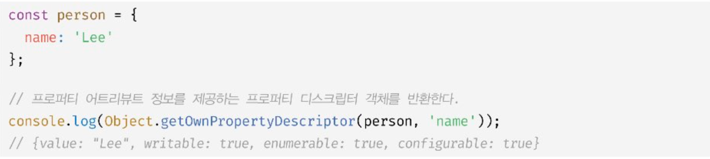

`Obejct.getOwnPropertyDescriptor` 메서드는 프로퍼티 어트리뷰트 정보를 제공하는 프로퍼티 드스크립터 객체를 반환한다. 존재하지 않는 프로퍼티나 상속받은 프로퍼티에 대한 프로퍼티 디스크립터를 요구하면 undefiend 반환한다.

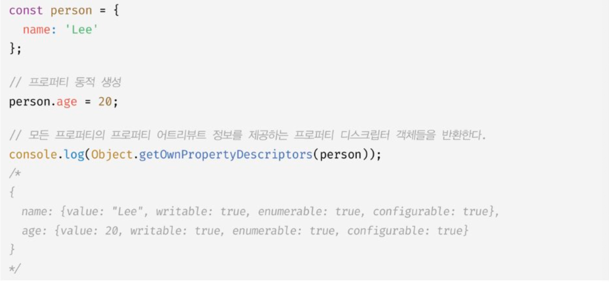

## 데이터 프로퍼티와 접근자 프로퍼티

프로퍼티는 데이터 프로퍼티와 접근자 프로퍼티로 구분할 수 있다.

데이터 프로퍼티 : 키와 값으로 구성된 프로퍼티.
접근자 프로퍼티 : 자체적으로 값을 갖지 않고 데이터 프로퍼티의 값을 읽거나 저장할 떄 호출되는 접근자 함수로 구성된 프로퍼티.

### 데이터 프로퍼티

이 프로퍼티 어트리뷰트는 자브스크립트 엔진이 프로퍼티를 생성할 때 기본값으로 자동 정의된다.

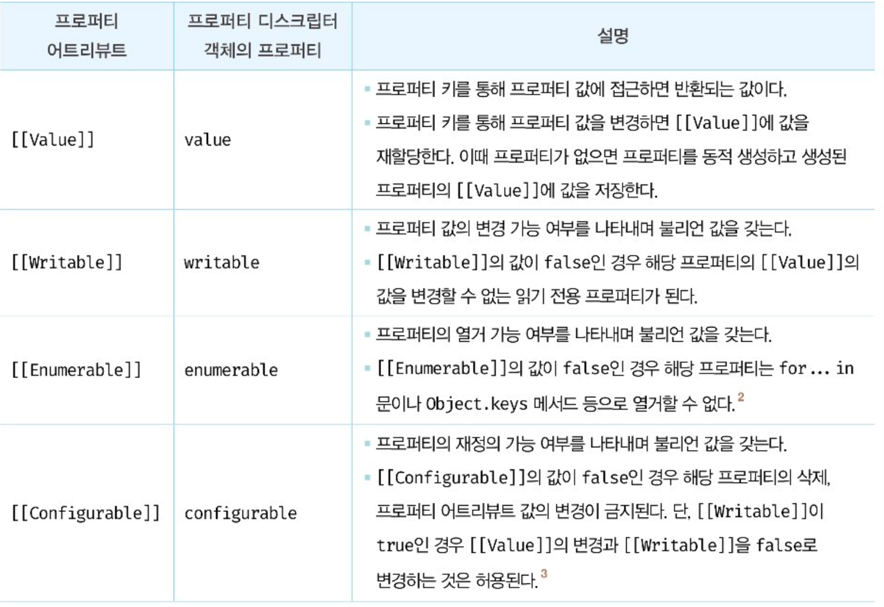

다음 코드를 살펴보자

```jsx
const person = {
  name: "Lee",
};

// 프로퍼티 어트리뷰트는 정보를 제공하는 프로퍼티 디스크립터 객체를 취득
console.log(Obejct.getOwnPropertyDescriptor(person, "name"));
// {value : 'Lee', Writable : true, enumerable:true, configurable :true}
```

`Obejct.getOwnPropertyDescriptor` 메서드가 반환한 객체를 살펴보면 `value` 프로퍼티 값은 Lee 다.다른 `writable`, `enumerable`, `configurable` 프로퍼티의 값은 모두 true 이다.

이처럼 프로퍼티가 생성될 때 value의 값은 프로퍼티 값으로 초기화되며`writable`,`enumerable`,`configurable` 의 값은 true로 초기화된다. 동적 추가해도 마찬가지다.

밑의 코드는 동적으로 추가한 코드이다.

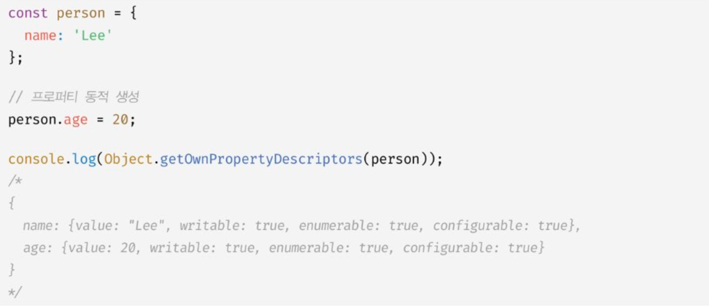

### 접근자 프로퍼티

접근자 프로퍼티는 값을 갖지 않고 데이터 프로퍼티의 값을 읽거나 저장할 때 사용하는 접근자 함수로 구성된 프로퍼티다.


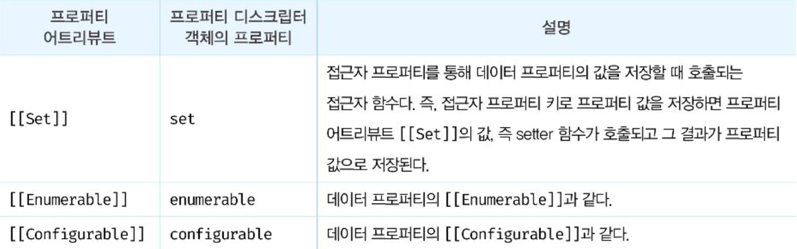

접귾자 함수는 getter/setter 함수라고도 부른다. 다음 코드를 살펴보자.

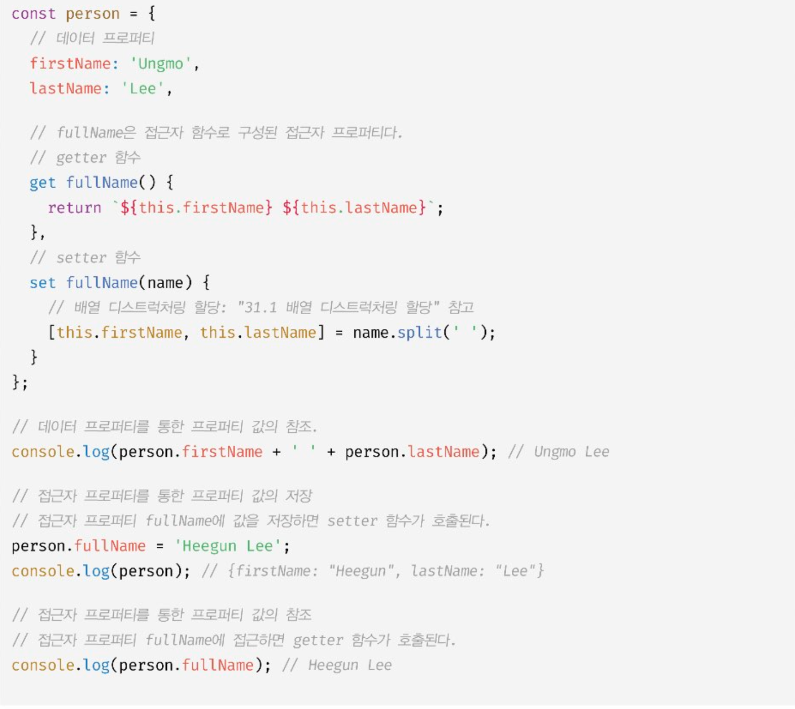

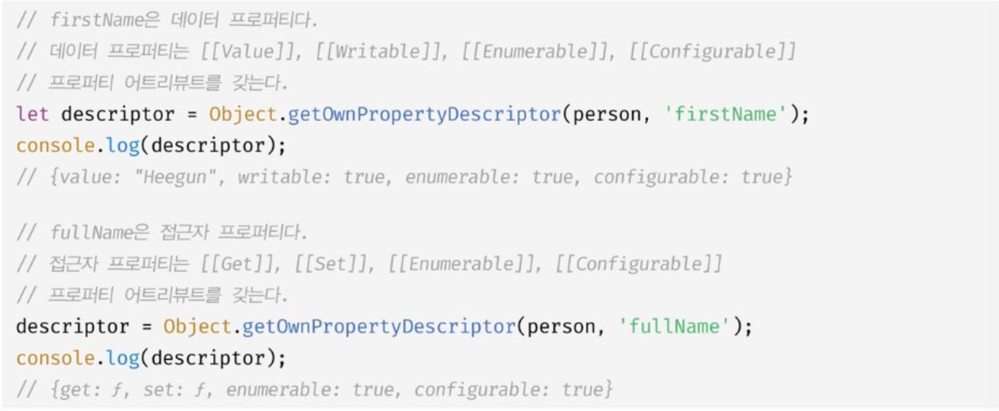

접근자 프로퍼티와 데이터 프로퍼티를 구별하는 방법은 다음과 같다.
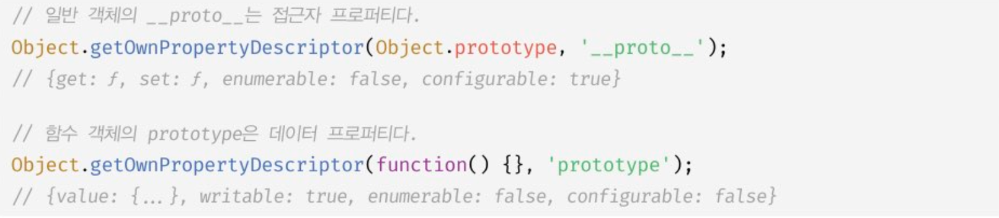

### 프로퍼티 정의

프로퍼티 정의란 새로운 프로퍼티를 추가하면서 프로퍼티 어트리뷰트를 명시적으로 정의하거나, 기존 프로퍼티의 프로퍼티 어트리뷰트를 재정의하는 것을 말한다. 값을 갱신 가능하도록 할 것인지, 열거 가능하도록 할 것인지, 재정의 가능하도록 할 것인지 정의할 수 있다.

Object.defineProperty 메서드를 사용하면 프로퍼티의 어트리뷰트를 정의할 수 있다. 인수로는 객체의 참조와 데이터 프로퍼티의 키인 문자열 프로퍼티 디스크립터 객체를 전달한다.

```js
const person = {};

// 데이터 프로퍼티 정의
Object.defineProperty(person, "firstName", {
  value: "Ungmo",
  writable: true,
  enumerable: true,
  configurable: true,
});

Object.defineProperty(person, "lastName", {
  value: "Lee",

let descriptor = Object.getOwnPropertyDescriptor(person, 'firstName');
console.log('firstName', descriptor);
// firstName {value: "Ungmo", writable: true, enumerable: true, configurable: true}

// 디스크립터 객체의 프로퍼티를 누락시키면 undefined, false가 기본값이다.
descriptor = Object.getOwnPropertyDescriptor(person, 'lastName');
console.log('lastName', descriptor);
// lastName {value: "Lee", writable: false, enumerable: false, configurable: false}

// [[Enumerable]]의 값이 false인 경우 해당 프로퍼티는 for...in 문이나 Object.keys 등으로 열거할 수 없다.
// lastName 프로퍼티는 [[Enumerable]]의 값이 false이므로 열거되지 않는다.
console.log(Object.keys(person)); // ["firstName"]

// [[Writable]]의 값이 false인 경우 해당 프로퍼티의 [[Value]] 값을 변경할 수 없다.
// lastName 프로퍼티는 [[Writable]]의 값이 false이므로 값을 변경할 수 없다.
// 이때 값을 변경하려 에러는 발생하지 않고 무시된다.
person.lastName = 'Kim';

// [[Configurable]]의 값이 false인 경우 해당 프로퍼티를 삭제할 수 없다.
// lastName 프로퍼티는 [[Configurable]]의 값이 false이므로 삭제할 수 없다.
// 이때 프로퍼티를 삭제하려 에러는 발생하지 않고 무시된다.
delete person.lastName;

// [[Configurable]]의 값이 false인 경우 해당 프로퍼티를 재정의할 수 없다.
Object.defineProperty(person, 'lastName', { enumerable: true });
// Uncaught TypeError: Cannot redefine property: lastName

descriptor = Object.getOwnPropertyDescriptor(person, 'lastName');
console.log('lastName', descriptor);
// lastName {value: "Lee", writable: false, enumerable: false, configurable: false}

// 접근자 프로퍼티 정의
Object.defineProperty(person, 'fullName', {
  // getter 함수
  get() {
    return `${this.firstName} ${this.lastName}`;
  },
  // setter 함수
  set(name) {
    [this.firstName, this.lastName] = name.split(' ');
  },
  enumerable: true,
  configurable: true
});


});
```

## 객체 변경 방지

객체는 변경 가능한 값이므로 재할당 없이 직접 변경할 수 있다. 프로퍼티를 추가하거나 삭제할 수 있고, 프로퍼티 값을 갱신할 수 있으며, Object.defineProperty 또는 Object.defineProperties 메서드를 사용하여 프로퍼티 어트리뷰트를 재정의할 수도 있다.

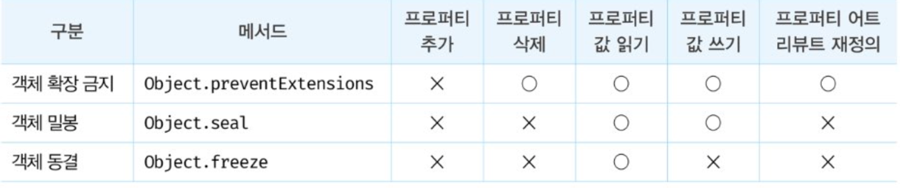

### 객체 확장 금지

Object.preventExtension 메서드는 객체의 확장을 금지한다.
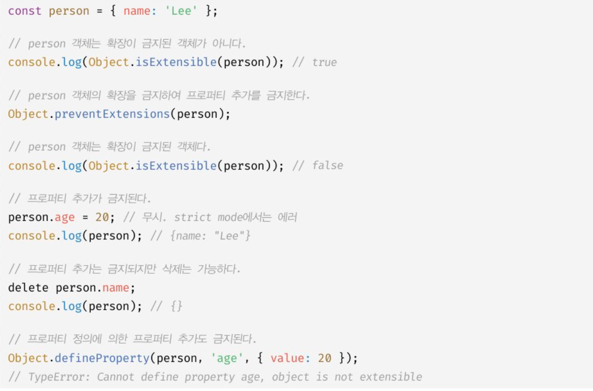

### 객체 밀봉

Object.seal 메서드는 객체를 밀봉한다. 밀봉이란 프로퍼티 추가 및 삭제와 프로퍼티 어트리뷰트 재정의 금지를 의마한다. 밀봉된 객체는 읽기와 쓰기만 가능하다.

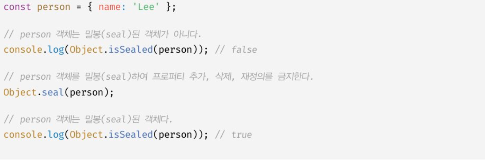

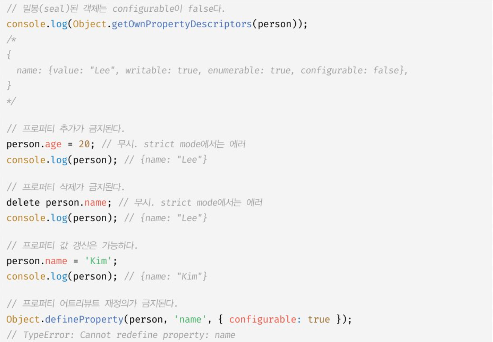

### 객체 동결

Object.freeze 메서드는 객체를 동결한다. 동결이란 프로퍼티 추가 및 삭제와 프로퍼티 어트리뷰트 재정의 금지, 프로퍼티 값 갱신 금지를 의미한다. 동결된 객체는 읽기만 가능하다.

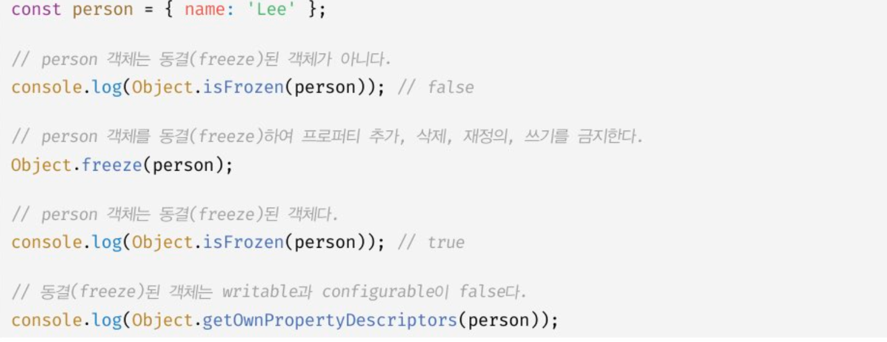

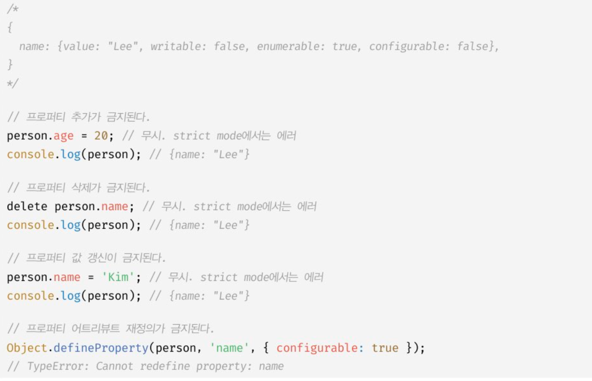

```

```
