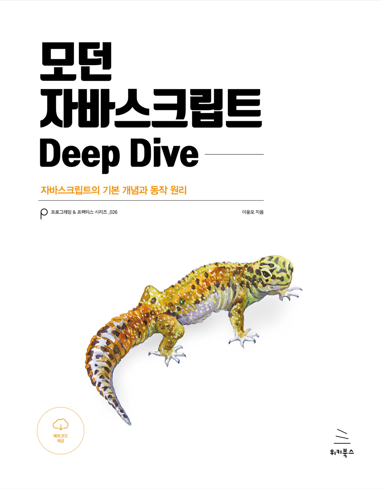

# 모던자바스크립트 딥다이브 스터디

## 참여자

| 오승택                                                  | 김문주                                                       |
| ------------------------------------------------------- | ------------------------------------------------------------ |
|  |  |

## 스터디 전 준비 사항

- 책 읽기
- 회차 폴더 안에 {이름}.md 파일 안에 공유할 내용 정리하기
- 공부한 내용 정리
- 질문(면접 질문 느낌)
- 인상 깊은 점
- 새로 알게된 개념
- 챕터당 퀴즈 최소 1개씩 문제내기
- commit ex) 오승택 : 1주차 완료

###

|           | Chatper                           | Date        |
| --------- | --------------------------------- | ----------- |
| **1주차** | 4.변수 & 5.표현식과 문            | 4/22 ~ 4/29 |
| **2주차** | 6.데이터 타입 & 7.연산자          | 4/29 ~ 5/6  |
| **3주차** | 8.제어문 & 9.타입변환과 단축 평가 | 5/7 ~ 5/13  |
